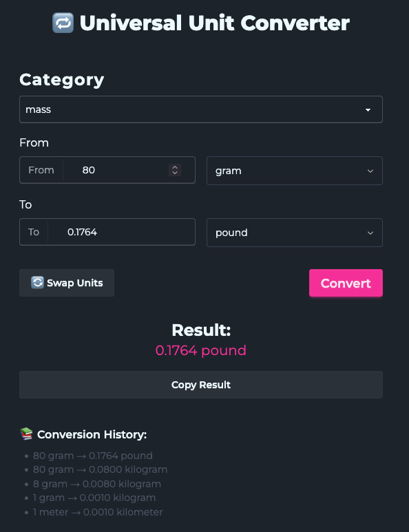

# 🔁 Universal Unit Converter

A simple and responsive web-based unit converter built with **React** and **Tailwind CSS**. Convert values across various real-world categories with precision and ease.



## ✨ Features

- 🌐 Convert units instantly as you type
- 🔄 Swap between units
- 📚 History of recent conversions
- 🧠 Categories:
  - 🔧 Engineering: Length, Mass, Force, Pressure, Energy, Power, Density, and more.
  - 💻 Digital: Bit/Byte conversions (kB, MB, GB, etc.), bandwidth units, data rates.
  - 🍳 Cooking: Cups, tablespoons, teaspoons, fluid ounces, grams, liters, pints, and other common culinary measurements.
  - 🌌 Astronomy: Light-years, parsecs, astronomical units, planetary mass, surface gravity, star classifications, and black hole mass scales.
- 📱 Fully responsive design
- 🎨 Clean Tailwind CSS styling

## 🚀 Demo

[Live Demo](https://unit-converter-jade-nine.vercel.app/)

## 🛠️ Tech Stack

- [React](https://reactjs.org/)
- [Tailwind CSS](https://tailwindcss.com/)
- [Daisy UI](https://daisyui.com/)
- Vite (for fast development)
- JavaScript (ES6+)

## 📦 Installation

1. **Clone the repository:**
   ```bash
   git clone https://github.com/defydef/unit-converter.git
   cd unit-converter
   ```
